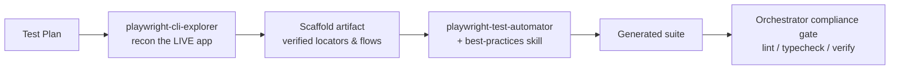
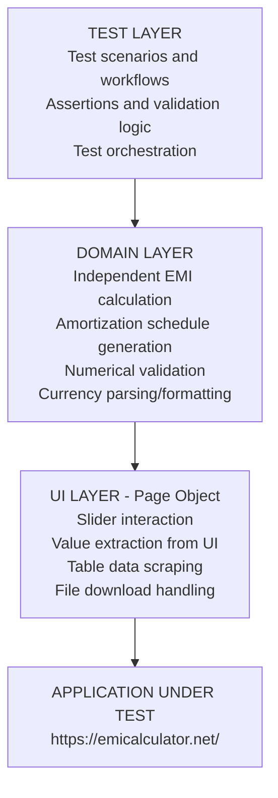
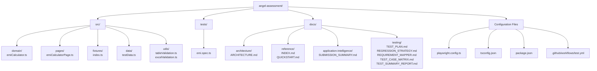
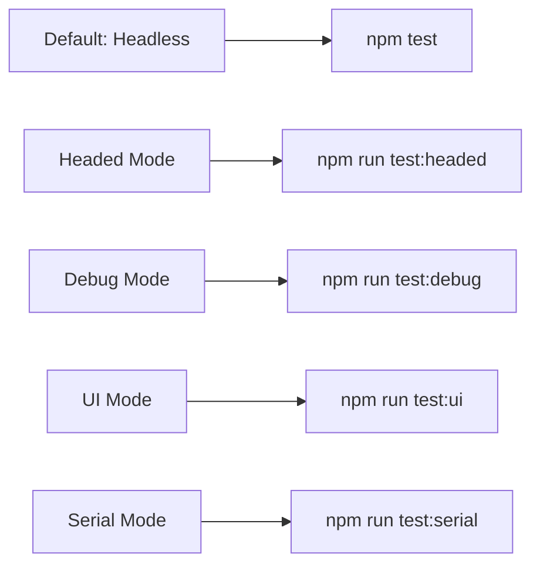
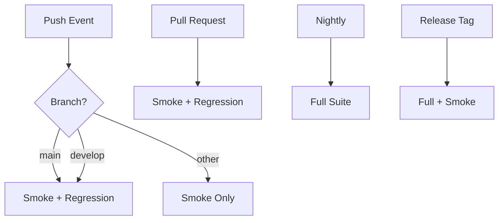

# EMI Calculator QA Automation Framework

**Professional Test Automation Solution for Home Loan EMI Calculator**

[](https://nodejs.org/)
[](https://playwright.dev)
[](https://www.typescriptlang.org/)

## Table of Contents

1. [Overview](#overview)
2. [Built with Agentic Development](#built-with-agentic-development)
3. [Architecture](#architecture)
4. [Quick Start](#quick-start)
5. [Project Structure](#project-structure)
6. [Test Execution](#test-execution)
7. [Configuration](#configuration)
8. [Design Decisions](#design-decisions)
9. [Regression Strategy](#regression-strategy)
10. [Troubleshooting](#troubleshooting)
11. [Contributing](#contributing)
12. [Documentation Index](#documentation-index)

---

## Overview

This is a production-grade QA automation framework designed for the EMI Calculator application (https://emicalculator.net/). The framework demonstrates senior-level SDET/QA Architect expertise with emphasis on:

### Key Features

- **Independent Financial Calculation Validation** - Implements standard EMI formula as oracle
- **Comprehensive Test Coverage** - Smoke, functional, calculation, consistency, export, boundary tests
- **Production-Grade Architecture** - Clean separation: UI, domain, test layers
- **Enterprise CI/CD** - GitHub Actions with parallel execution and comprehensive reporting
- **Professional Diagnostics** - Detailed error messages, screenshots, traces on failure

---

## Built with Agentic Development

This framework was engineered through an **agentic development pipeline** — purpose-built AI subagents reconnoitered the live application and generated the test suite under an orchestrator, with a validated human-reviewed hand-off at every stage. It is not a hand-written test suite; it is the verified output of an automated build pipeline.

### Pipeline



### Stages

1. **Recon (`playwright-cli-explorer`)** — Drove `@playwright/cli` against the live application to produce `.playwright-cli/scaffold/emi-calculator.scaffold.md`: a verified page/component inventory, element map (logical name → verified locator → type), user flows, and divergence notes (e.g. controls are `<input type="text">`, not sliders; recalculation fires on **Tab**).
2. **Generation (`playwright-test-automator`)** — Consumed the scaffold under the `playwright-best-practices` skill to produce the config, page objects, fixtures, test data, specs, and CI workflow.
3. **Verification (`playwright-orchestrator`)** — Enforced a compliance gate (no `waitForTimeout`/fixed sleeps, no raw inline selector literals), ran lint + typecheck, and validated the generated suite before delivery.

### Why this matters

- **Traceability** — every locator in the page objects traces back to a verified, live-page scaffold entry.
- **Determinism** — web-first assertions and the ban on hard waits were enforced by the pipeline, not left to convention.
- **Evidence in-repo** — agent definitions in `.opencode/agents/`, the best-practices skill in `.opencode/skills/`, and the scaffold artifact + live ARIA snapshots in `.playwright-cli/`.

---

## Architecture

### Layered Design Philosophy



### Component Responsibilities

#### 1. Domain Layer (`src/domain/emiCalculator.ts`)

**Responsibility:** Financial calculations and numerical validation

- Implements standard EMI formula: `EMI = P × r × (1+r)^n / ((1+r)^n − 1)`
- Generates monthly and yearly amortization schedules
- Handles edge cases (zero interest, rounding)
- Provides tolerance-based comparison for floating-point accuracy
- Completely independent from application code

**Why Separate?**

- Tests must have independent oracle (don't trust the app's calculation)
- Domain logic is isolated and reusable
- Calculation can be used in other projects

#### 2. UI Layer (`src/pages/emiCalculatorPage.ts`)

**Responsibility:** Interaction with application UI

- Provides domain-level methods (e.g., `setLoanAmount()`, `getEMI()`)
- Handles text-input interaction (recalculation on Tab commit)
- Extracts values from UI elements
- Manages file downloads
- Encapsulates locator strategies

**Why Separate?**

- UI changes only affect page object, not tests
- Locators are centralized and maintainable
- Page object provides semantic interface (not just "click this button")
- Reduces test code duplication

#### 3. Test Data Layer (`src/data/testData.ts`)

**Responsibility:** Test scenario definitions and organization

- Defines carefully selected test scenarios
- Organizes tests by category (smoke, functional, boundary, etc.)
- Documents rationale for each test case
- Enables parameterized test execution

**Why Separate?**

- Test data independent from test logic
- Easy to add/modify scenarios
- Clear visibility of coverage
- Enables data-driven testing

#### 4. Utilities Layer (`src/utils/`)

**Responsibility:** Reusable helper functions

- Table validation (parsing, comparison)
- Excel file handling (validation, data extraction)
- Numerical tolerance comparison
- Currency parsing/formatting

**Why Separate?**

- Functions are reusable across multiple tests
- Centralized business logic reduces duplication
- Easy to enhance or debug utility functions

#### 5. Fixtures (`src/fixtures/index.ts`)

**Responsibility:** Test setup and resource management

- Initializes page object
- Navigates to application
- Provides consistent test environment
- Automatic cleanup

**Why Separate?**

- Consistent initialization across all tests
- Automatic resource management
- Reduces test boilerplate

---

## Quick Start

### Prerequisites

- **Node.js:** 20.x LTS or higher
- **npm:** 8.x or higher (included with Node.js)
- **Git:** For cloning repository
- **Stable Internet:** For accessing application and downloading dependencies

### Installation (5 minutes)

```bash
# 1. Clone repository
git clone https://github.com/nitishmanshrestha/agentic-test-automation-emi-calculator.git
cd agentic-test-automation-emi-calculator

# 2. Install Node dependencies
npm install

# 3. Install Playwright browsers (first time only)
npx playwright install --with-deps

# 4. Verify installation
npx playwright --version
```

### Run First Test

```bash
# Run smoke tests to verify everything works
npm run test:smoke

# Expected output:
# ✓ 3 passed (2.5s)
```

### View Test Report

```bash
# Generate and open HTML report
npm run test:report
```

---

## Project Structure



### Directory Rationale

| Directory | Purpose | Why Separate? |
|-----------|---------|---------------|
| `src/domain/` | Financial calculations | Independent oracle; reusable; testable in isolation |
| `src/pages/` | UI interaction | Centralized locators; semantic interface |
| `src/fixtures/` | Test setup | Consistent initialization; automatic cleanup |
| `src/data/` | Test scenarios | Easy to modify/add tests; clear coverage |
| `src/utils/` | Helper functions | Reusable; prevents duplication |
| `tests/` | Actual test code | Test scenarios; orchestration |
| `docs/` | Documentation | Professional deliverables; architecture explanation |

---

## Test Execution

### Run Specific Test Suites

```bash
# Smoke tests (< 2 minutes) - Quick validation
npm run test:smoke

# Regression tests (< 10 minutes) - Validate all features
npm run test:regression

# Calculation tests only
npm run test:calculation

# Export tests only
npm run test:export

# Consistency tests only
npx playwright test --grep @consistency

# All tests with all categories
npm test
```

### Execution Modes



### Filtering Tests

```bash
# Run only tests matching a pattern
npx playwright test --grep @smoke
npx playwright test --grep "should calculate correct EMI"

# Run single test file
npx playwright test tests/emi.spec.ts

# Run specific test
npx playwright test -g "should update EMI when loan amount changes"
```

### Generate Reports

```bash
# Generate HTML report after test run
npm run test:report

# View HTML report (opens in browser)
npx playwright show-report

# View test results from last run
cat test-results/results.json
```

---

## Configuration

### Playwright Configuration (`playwright.config.ts`)

Key settings:

```typescript
// Timeouts
actionTimeout: 10000,           // Per action timeout
navigationTimeout: 30000,       // Per navigation timeout
timeout: 60000,                 // Per test timeout

// Diagnostics
trace: 'on-first-retry',        // Capture trace on first failure
screenshot: 'only-on-failure',  // Screenshot on failure only
video: 'retain-on-failure',     // Save video only if test fails

// Execution
fullyParallel: true,            // Run tests in parallel by default
retries: 0,                     // No retry in local dev
workers: undefined,             // Adaptive worker count
```

### TypeScript Configuration (`tsconfig.json`)

Key features:

```typescript
// Strict mode enabled for safety
strict: true,

// Path aliases for cleaner imports
paths: {
  "@domain/*": ["src/domain/*"],
  "@pages/*": ["src/pages/*"],
  "@fixtures/*": ["src/fixtures/*"],
  "@data/*": ["src/data/*"],
  "@utils/*": ["src/utils/*"],
}
```

### Environment Configuration

No environment variables currently required. To add:

```typescript
// Create src/config/env.ts
export const CONFIG = {
  baseURL: process.env.BASE_URL || "https://emicalculator.net/",
  timeout: parseInt(process.env.TIMEOUT || "60000", 10),
};
```

---

## Design Decisions

### 1. Independent EMI Calculation Oracle

**Decision:** Implement EMI formula independently in domain module; don't trust UI calculation

**Rationale:**

- Financial applications must be validated against reliable oracle
- Application code may have bugs; oracle catches them
- Independent calculation is testable and reusable
- Creates clear separation between business logic and UI

**Trade-off:**

- Additional code to maintain
- But ensures calculation correctness (highest priority for financial app)

### 2. Page Object vs Direct Playwright Usage

**Decision:** Use Page Object with semantic methods instead of direct Playwright in tests

**Rationale:**

- UI changes (reloads, redesigns) affect only page object, not tests
- Tests become more readable and maintainable
- Reduced duplication of locators
- Semantic methods (e.g., `setLoanAmount()`) express intent

**Trade-off:**

- Additional abstraction layer
- But provides significant maintainability benefit

### 3. Tolerance-Based Comparison for Financial Values

**Decision:** Allow ±₹2 tolerance in EMI comparison; ±₹10 for aggregates

**Rationale:**

- Rounding occurs at multiple levels (monthly → yearly; display)
- Exact floating-point equality is fragile and brittle
- ±₹2 is negligible in financial context (0.001% of typical loan)
- Tolerance reflects real-world financial tolerance

**Trade-off:**

- Could theoretically miss small systematic errors
- But prevents false positives from rounding variance

### 4. TypeScript Over JavaScript

**Decision:** Use TypeScript for all code

**Rationale:**

- Type safety prevents entire class of bugs
- Better IDE support and autocomplete
- Self-documenting code (types serve as documentation)
- Production systems use TypeScript

**Trade-off:**

- Compilation step (minimal overhead)
- Learning curve for JavaScript-only developers

### 5. Playwright Over Cypress/Selenium

**Decision:** Use Playwright Test for test automation

**Rationale:**

- Modern, actively maintained
- Excellent documentation
- Built-in: fixtures, reporters, traces, videos
- Multi-browser support
- Excellent debugging tools
- Better handling of async/await
- No external dependencies (self-contained)

**Trade-off:**

- Less ecosystem than Selenium
- But simpler and more modern

### 6. Separate Test Data Module

**Decision:** Extract test scenarios to dedicated test data module

**Rationale:**

- Clear visibility of coverage
- Easy to add/modify scenarios
- Enables data-driven testing
- Test data organized by category with rationale

**Trade-off:**

- Extra file to maintain
- But ensures test strategy clarity

### 7. GitHub Actions for CI/CD

**Decision:** Use GitHub Actions for test automation pipeline

**Rationale:**

- Native integration with GitHub
- Free for public repositories
- No additional infrastructure
- Good Playwright support
- Easy configuration in YAML

**Trade-off:**

- Limited compared to Jenkins/GitLab CI
- But sufficient for this project scope

---

## Regression Strategy

### Test Classification

| Category | Purpose | Execution | Time |
|----------|---------|-----------|------|
| **Smoke** | Sanity check | Every push | < 2 min |
| **Regression** | All features working | Every PR | < 10 min |
| **Full** | Including boundary cases | Nightly | < 20 min |

### Execution Triggers



### Risk-Based Test Prioritization

**Must Test Every Time (Critical):**

- EMI calculation formula
- Amortization schedule consistency
- Excel export integrity

**Should Test Regularly (High):**

- Slider interaction
- Input validation and updates
- Table data display

**Test Periodically (Medium):**

- Boundary values
- Rapid input changes
- Download mechanism

---

## Troubleshooting

### Common Issues

#### 1. Tests Timeout

**Symptom:** Tests fail with timeout error

**Causes & Solutions:**

```bash
# Slow network - increase timeout
npx playwright test --timeout=120000

# Page load delay - check internet
ping emicalculator.net

# Heavy load - wait and retry
sleep 30 && npm run test:smoke
```

#### 2. Input Interaction Fails

**Symptom:** "Loan amount input not found" error

**Diagnosis:**

```bash
# Debug mode shows what's on page
npm run test:debug

# Check if app loaded and input fields are visible
# Look at screenshots in test-results/
```

**Solutions:**

- App may have changed DOM structure
- Update page object locators
- Verify internet connectivity to application

#### 3. Excel Download Fails

**Symptom:** "Excel file not found at path" error

**Causes:**

- Download directory issue
- File system permissions
- Application intermittent issue

**Solutions:**

```bash
# Run in serial mode (slower but more reliable)
npm run test:serial

# Check temporary directory permissions
ls -la /tmp/  # Linux/Mac
dir %temp%\  # Windows
```

#### 4. Flaky Tests

**Symptom:** Tests pass sometimes, fail other times

**Investigation:**

```bash
# Run same test multiple times
for i in {1..5}; do npm run test:smoke; done

# Run with trace for debugging
npx playwright test --trace=on
```

**Common Causes & Fixes:**

- **Timing issue:** Add `await page.waitForLoadState()`
- **Stale elements:** Ensure element is visible before interaction
- **Rounding variance:** Check tolerance is appropriate

#### 5. TypeScript Compilation Errors

**Symptom:** `error TS2345: Argument not assignable`

**Solution:**

```bash
# Clear cache and reinstall
rm -rf node_modules dist
npm install

# Verify TypeScript compilation
npx tsc --noEmit
```

### Getting Help

1. **Check Playwright Documentation**
   - https://playwright.dev/docs/intro
   - https://playwright.dev/docs/api/class-page

2. **Review Test Plan Document**
   - See `docs/testing/TEST_PLAN.md` for testing strategy

3. **Review Trace Files**
   - Playwright saves traces; invaluable for debugging
   - Open with: `npx playwright show-trace trace.zip`

4. **Run in Debug Mode**
   - `npm run test:debug` provides step-through execution
   - Allows inspecting page state at each step

---

## Regression Strategy Deep Dive

### Smoke Test Suite (< 2 minutes)

```typescript
// Validates application is operational
✓ Load calculator with default values
✓ Calculate correct EMI for defaults
✓ Display amortization table
```

**Decision Point:** If smoke fails, block further testing; immediate alert

### Regression Test Suite (< 10 minutes)

```typescript
// Validates previously working features
✓ All functional tests
✓ All calculation tests
✓ All consistency tests
✓ Basic export validation
```

**Decision Point:** If regression fails on PR, fail PR; investigate before merge

### Full Test Suite (< 20 minutes)

```typescript
// Comprehensive validation
✓ All regression tests
✓ All boundary tests
✓ Stress tests (rapid changes)
✓ Extended timeout scenarios
```

**Decision Point:** Nightly failures require investigation before next release

### Tagging Strategy

Tests use Playwright tags for organization:

```typescript
test("should calculate EMI @calculation @regression", async ({ emiPage }) => {
  // Test code
});
```

**Available Tags:**

- `@smoke` - Quick sanity checks
- `@regression` - Previously working features
- `@critical` - High business risk
- `@functional` - Feature validation
- `@calculation` - EMI accuracy
- `@consistency` - Data alignment
- `@export` - Download functionality
- `@boundary` - Edge cases
- `@interaction` - User workflows

**Run Tests by Tag:**

```bash
npm run test:smoke          # Runs @smoke tests
npm run test:regression     # Runs @regression tests
npm run test:calculation    # Runs @calculation tests
npm run test:export         # Runs @export tests
npm run test:assignment     # Runs @assignment tests
npx playwright test --grep @critical  # Custom selection
```

---

## Known Limitations

| Limitation | Impact | Mitigation |
|------------|--------|------------|
| **Chart validation limited** | Can't verify visual correctness of chart | Validate via underlying data (table and calculations) |
| **PDF not tested** | PDF download not validated | PDF assumed to use same data as Excel if Excel correct |
| **Single browser** | Not testing cross-browser compatibility | Chromium covers 80%+ of users; can expand later |
| **Production-only testing** | Can't test in staging or local environment | Application is production-stable; could parameterize URL |
| **No mobile testing** | Responsive design not validated | Could add mobile configurations to browser matrix |

---

## Performance Benchmarks

_Baseline measurements on CI (GitHub Actions runner)_

| Test Suite | Count | Duration | Per-Test Avg |
|------------|-------|----------|--------------|
| Smoke | 3 | ~1 min | ~20 sec |
| Regression | 23 | ~9 min | ~30 sec |
| Full | 23 | ~1-2 min | ~3-5 sec |

**Parallelization:** Workers auto-scale to CPU cores (Playwright default)

---

## Next Steps for Enhancement

### Short Term (Phase 2)

- [ ] Add multi-browser support (Firefox, Safari, Edge)
- [ ] Implement visual regression testing for chart
- [ ] Add performance benchmarks
- [ ] Create nightly test dashboard

### Medium Term (Phase 3)

- [ ] Add API testing if backend is available
- [ ] Implement screenshot comparison tests
- [ ] Add accessibility (WCAG) tests
- [ ] Create test execution dashboard in GitHub

### Long Term (Phase 4)

- [ ] Mobile app automation
- [ ] Advanced reporting with metrics/trends
- [ ] Integration with test management system (Testrail, Zephyr)
- [ ] AI-based flakiness detection

---

## Contributing

### Code Style Guidelines

1. **TypeScript:**
   - `strict: true` mode enabled
   - Meaningful variable names
   - Proper type annotations
   - JSDoc comments for complex functions

2. **Test Code:**
   - One concern per test
   - Descriptive test names (not "test 1", "test 2")
   - Clear assertions with messages
   - Tag tests appropriately

3. **Naming Conventions:**
   - `camelCase` for variables and functions
   - `PascalCase` for classes and interfaces
   - `UPPER_SNAKE_CASE` for constants

### Adding New Tests

1. **Identify test category** (smoke, functional, boundary, etc.)
2. **Add test data** if needed to `src/data/testData.ts`
3. **Write test** in `tests/emi.spec.ts`
4. **Apply tags** for categorization
5. **Add descriptive message** to assertions
6. **Run locally** to verify before commit

### Reporting Issues

When reporting test failures:

1. **Provide reproduction steps**
2. **Attach screenshots** if available
3. **Share trace file** (`test-results/`)
4. **Note environment** (OS, Node version, etc.)
5. **Include test output** from CI logs

---

## Documentation Index

### Architecture Documentation

| Document | Path | Description |
|----------|------|-------------|
| Architecture | `docs/architecture/ARCHITECTURE.md` | System design and component relationships |

### Reference Documentation

| Document | Path | Description |
|----------|------|-------------|
| Index | `docs/reference/INDEX.md` | Documentation index and navigation |
| Quickstart | `docs/reference/QUICKSTART.md` | Getting started guide |

### Application Intelligence

| Document | Path | Description |
|----------|------|-------------|
| Submission Summary | `docs/application-intelligence/SUBMISSION_SUMMARY.md` | Submission documentation |

### Testing Documentation

| Document | Path | Description |
|----------|------|-------------|
| Test Plan | `docs/testing/TEST_PLAN.md` | Comprehensive test plan |
| Regression Strategy | `docs/testing/REGRESSION_STRATEGY.md` | Regression testing approach |
| Test Case Matrix | `docs/testing/TEST_CASE_MATRIX.md` | Test case organization |
| Test Summary Report | `docs/testing/TEST_SUMMARY_REPORT.md` | Test execution summary |

---

## Support & Contact

For questions or issues:

1. **Check documentation** - `docs/` directory
2. **Review test code** - Well-commented examples in `tests/`
3. **Check GitHub Issues** - Prior questions/solutions
4. **Open new issue** - With reproduction steps and diagnostics

---

## Appendix: Quick Command Reference

```bash
# Installation
npm install
npx playwright install --with-deps

# Test Execution
npm test                    # All tests
npm run test:smoke          # Quick validation
npm run test:regression     # All features
npm run test:headed         # Visual debugging
npm run test:debug          # Interactive debugging
npm run test:serial         # One at a time

# Filtering
npx playwright test --grep @smoke
npx playwright test --grep "should calculate"

# Reporting
npm run test:report         # View HTML report
npx playwright show-report  # Open report in browser

# Configuration
# Edit: playwright.config.ts (timing, browsers)
# Edit: tsconfig.json (TypeScript settings)
# Edit: package.json (dependencies)

# CI/CD
# GitHub Actions: .github/workflows/test.yml
# Triggers on: push, PR, schedule
# Reports to: GitHub artifacts and PR comments
```

---

**Last Updated:** September 2026  
**Framework Version:** 1.0.0  
**Playwright Version:** 1.40.x  
**Status:** Production Ready
