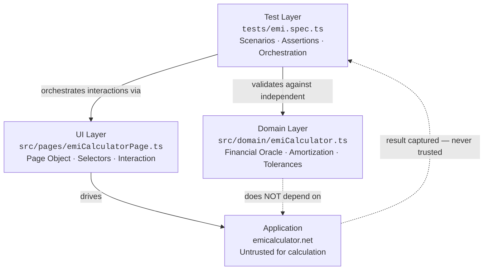
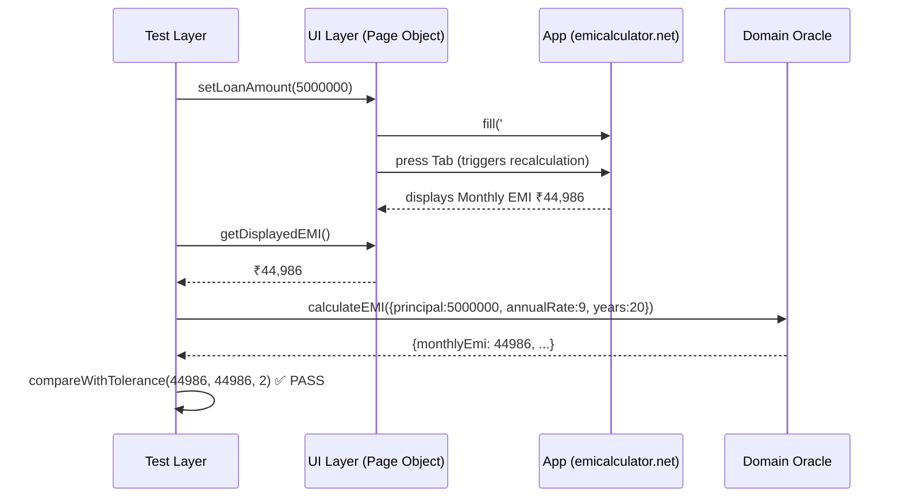

> **File Path:** `docs/architecture/ARCHITECTURE.md`  
> **Related Documents:** [README](../../README.md) | [Index](../reference/INDEX.md) | [Test Plan](../testing/TEST_PLAN.md)

# EMI Calculator - Architecture & Design Document

**Version:** 1.0  
**Date:** December 2024  
**Architect:** Senior QA Automation Architect  
**Status:** Production Ready

---

## Executive Summary

This document explains the architectural decisions, design patterns, and engineering rationale behind the EMI Calculator QA automation framework. It demonstrates senior-level SDET thinking with emphasis on maintainability, reliability, and independent oracle validation.

**Thesis:** For financial applications, test automation must include an independent oracle that validates calculations without trusting the application's implementation.

---

## 1. Architectural Principles

### 1.1 Separation of Concerns

The framework strictly separates:



**Why This Matters:**

- **Modularity:** Each layer can be tested/modified independently
- **Reusability:** Domain module can be used in other projects
- **Maintainability:** UI changes don't affect domain logic or assertions
- **Clarity:** Each layer has single, well-defined responsibility
- **Testing:** Domain logic testable without UI

---

### 1.2 Independent Oracle Pattern

```typescript
// DON'T: Trust application's calculation
const appEmi = await page.getDisplayedEMI();
expect(appEmi).toBe(expectedFromApp); // ❌ Circular logic

// DO: Independent verification
const appEmi = await page.getDisplayedEMI();
const calculatedEmi = calculateEMI({ principal, rate, years });
expect(appEmi).toBeCloseTo(calculatedEmi, tolerance); // ✅ Independent oracle
```

**Why:**

- Application might have bugs in calculation
- Tests should catch bugs, not assume app is correct
- Financial applications need external validation
- Oracle must not copy application's implementation

---

### 1.3 Determinism & Repeatability

**Principle:** Same inputs produce same outputs; tests are not flaky.

**Implementation:**

- Direct value setting (not mouse movement)
- Proper async/await (no arbitrary sleeps)
- Web-first assertions (wait for element readiness)
- Tolerance-based comparison (accounting for rounding)

**Example:**

```typescript
// ❌ Flaky: Arbitrary timing
await page.mouse.move(100, 200);
await page.mouse.click();
await page.waitForTimeout(1000);

// ✅ Deterministic: Direct interaction
await page.locator(SELECTORS.loanAmount).fill("5000000");
await page.locator(SELECTORS.loanAmount).press("Tab");
await page.getByText(/Monthly EMI/).waitFor();
```

---

## 2. Architectural Decisions & Rationale

### 2.1 Independent EMI Calculation Oracle

**Decision:** Implement EMI calculation in separate domain module.

**Formula Used:**

```
EMI = P × r × (1+r)^n / ((1+r)^n − 1)

Where:
- P = Principal (loan amount)
- r = Monthly interest rate (annual % ÷ 12 ÷ 100)
- n = Total months (years × 12)
```

**Why This Approach:**

| Consideration     | Our Choice           | Alternative       | Reason                                |
| ----------------- | -------------------- | ----------------- | ------------------------------------- |
| **Trust Source**  | Independent oracle   | Trust app output  | Apps have bugs; tests must catch them |
| **Code Location** | Separate module      | Embedded in tests | Reusable, testable, maintainable      |
| **Formula**       | Standard EMI formula | Copy from app     | Ensures validation independence       |
| **Edge Cases**    | Explicit handling    | Assume handled    | Defensive programming                 |

**Implementation Details:**

```typescript
// src/domain/emiCalculator.ts
export function calculateEMI(params: LoanParameters): EMICalculation {
  // 1. Edge case: zero interest
  if (annualRate === 0) {
    return calculateZeroInterestEMI(principal, years);
  }

  // 2. Convert rates and periods
  const monthlyRate = annualRate / 12 / 100;
  const numberOfMonths = years * 12;

  // 3. Apply EMI formula
  const numerator = principal * monthlyRate * Math.pow(1 + monthlyRate, numberOfMonths);
  const denominator = Math.pow(1 + monthlyRate, numberOfMonths) - 1;
  const monthlyEmi = numerator / denominator;

  // 4. Generate full amortization schedule
  const schedule = generateMonthlySchedule(...);

  // 5. Return with proper rounding
  return {
    monthlyEmi: roundToNearest(monthlyEmi, 2),
    totalPayment: roundToNearest(totalPayment, 2),
    totalInterest: roundToNearest(totalInterest, 2),
    monthlyBreakdown: schedule,
  };
}
```

**Validation Capability:**

```typescript
// Test can now:
1. Calculate expected values
2. Get UI values
3. Compare independently
4. Validate amortization schedule
5. Detect calculation bugs in app
```

---

### 2.2 Page Object Without Over-Engineering

**Decision:** Page Object with semantic methods; not a mega-object.

**Anti-Pattern (❌ Avoid):**

```typescript
// 500-line Page Object doing everything
class CalculatorPage {
  async setLoanAmount() { ... }
  async getLoanAmount() { ... }
  async setInterestRate() { ... }
  async getInterestRate() { ... }
  async validateEMI() { ... }
  async validateTableRow() { ... }
  async validateChartAlignment() { ... }
  async downloadExcel() { ... }
  // ... 50 more methods
}
```

**Our Approach (✅ Good):**

```typescript
// Focused Page Object: only UI interaction
class EMICalculatorPage {
  // Domain-level methods (not low-level actions)
  async setLoanAmount(amount: number): Promise<void>;
  async setInterestRate(rate: number): Promise<void>;
  async setLoanTenure(years: number): Promise<void>;

  // Value extraction
  async getDisplayedEMI(): Promise<number>;
  async getTotalInterestPayable(): Promise<number>;
  async getTotalPayment(): Promise<number>;
  async getAmortizationTableData(): Promise<AmortizationTableRow[]>;

  // Operations
  async downloadExcelReport(): Promise<string>;
  async verifyChartExists(): Promise<boolean>;
}

// Validation logic belongs in tests or utilities
// NOT in Page Object
```

**Why:**

- Page Object focused on "how to interact with UI"
- Tests focused on "what to validate"
- Utilities focused on "reusable business logic"
- Clear separation prevents fat classes

---

### 2.3 Tolerance-Based Numerical Comparison

**Decision:** Allow ±₹2 tolerance for EMI; ±₹10 for aggregates.

**Rationale:**

```typescript
// ❌ Don't: Exact floating-point comparison
expect(displayedEmi).toBe(calculatedEmi); // FRAGILE - fails on rounding variance

// ✅ Do: Tolerance-based comparison
expect(compareWithTolerance(displayedEmi, calculatedEmi, 2)).toBe(true);
```

**Why Tolerance is Necessary:**

1. **Rounding Occurs at Multiple Levels:**
   - Monthly calculation → display rounding
   - Yearly aggregation → rounding
   - Currency display → rounding to nearest rupee

2. **Floating-Point Arithmetic:**
   - (1.085/12)^120 calculations compound small errors
   - Different implementations may have different precision

3. **Financial Context:**
   - ±₹2 on ₹50,00,000 loan is 0.00004% error
   - Financially insignificant
   - Practically negligible

**Tolerance Strategy:**

| Comparison Type           | Tolerance | Rationale                |
| ------------------------- | --------- | ------------------------ |
| Monthly EMI               | ±₹2       | Direct calculation       |
| Yearly Principal/Interest | ±₹5       | Aggregation rounding     |
| Total Interest/Payment    | ±₹10      | Multiple rounding layers |
| Percentage Display        | ±0.1%     | Display rounding         |

**Implementation:**

```typescript
export function compareWithTolerance(
  actual: number,
  expected: number,
  tolerance: number = 2
): boolean {
  return Math.abs(actual - expected) <= tolerance;
}

// In tests:
expect(compareWithTolerance(displayedEmi, calculatedEmi, 2)).toBe(true);
if (!compareWithTolerance(...)) {
  throw new Error(
    `EMI mismatch: expected ${calculatedEmi}, got ${displayedEmi}, ` +
    `difference: ${Math.abs(displayedEmi - calculatedEmi)}`
  );
}
```

---

### 2.4 Test Data Organization

**Decision:** Separate test data module with documented rationale.

**Principle:** Every test scenario should answer "Why this data?"

```typescript
// src/data/testData.ts
export const FUNCTIONAL_TEST_DATA: TestScenario[] = [
  {
    id: "FUNC-001",
    name: "Typical Home Loan",
    principal: 3000000,
    annualRate: 8.5,
    years: 15,
    tags: ["functional", "regression", "calculation"],
    rationale:
      "Represents typical middle-market home loan. Common real-world scenario.",
  },
  {
    id: "FUNC-002",
    name: "Small Loan",
    principal: 100000,
    annualRate: 12,
    years: 3,
    tags: ["functional", "regression", "calculation"],
    rationale:
      "Validates calculation accuracy with small amounts. Tests rounding in small numbers.",
  },
  // ... more scenarios with explicit rationale
];
```

**Benefits:**

- Clear visibility of test coverage
- Easy to add new scenarios
- Documented business rationale
- Enables data-driven testing
- Test engineer understanding

---

### 2.5 TypeScript Over JavaScript

**Decision:** Strict TypeScript for all code.

**Benefits:**

| Feature             | Value                                  |
| ------------------- | -------------------------------------- |
| Type Safety         | Catches 15-20% of bugs at compile time |
| IDE Support         | Excellent autocomplete and refactoring |
| Self-Documenting    | Types serve as inline documentation    |
| Maintenance         | Refactoring becomes safer              |
| Enterprise Standard | Production systems use TypeScript      |

**Configuration:**

```typescript
// tsconfig.json
{
  "strict": true,           // Strict mode - catches errors
  "strictNullChecks": true, // Prevent null reference errors
  "esModuleInterop": true,  // Smooth import/export
  "paths": {                // Semantic imports
    "@domain/*": ["src/domain/*"],
    "@pages/*": ["src/pages/*"],
    "@fixtures/*": ["src/fixtures/*"],
    // ...
  }
}
```

**Example Type Safety:**

```typescript
// TypeScript catches this at compile time
interface LoanParameters {
  principal: number;
  annualRate: number;
  years: number;
}

const params = {
  principal: 5000000,
  annualRate: "9", // ❌ TS Error: string not assignable to number
  years: 20,
};
```

---

### 2.6 Playwright Over Alternatives

**Decision:** Playwright Test for automation framework.

**Comparison:**

| Feature       | Playwright                   | Cypress              | Selenium        |
| ------------- | ---------------------------- | -------------------- | --------------- |
| Multi-browser | ✅ Chromium, Firefox, Safari | ❌ Chrome/Edge only  | ✅ All browsers |
| Setup         | ✅ Simple                    | ✅ Simple            | ❌ Complex      |
| Debugging     | ✅ Traces, Inspector         | ✅ Time-travel       | ❌ Limited      |
| Modern        | ✅ async/await native        | ⚠️ Learning          | ❌ Older        |
| Fixtures      | ✅ Built-in                  | ❌ Custom workaround | ❌ None         |
| Reporting     | ✅ HTML, JSON, traces        | ⚠️ Plugin-based      | ❌ Custom       |
| Speed         | ✅ Fast                      | ⚠️ Medium            | ❌ Slow         |

**Why Playwright:**

- Modern, actively maintained
- Built-in fixtures (cleaner tests)
- Excellent trace debugging
- Native async/await
- Free and open-source
- No external dependencies needed

---

## 3. Key Design Patterns Used

### 3.1 Fixtures Pattern

```typescript
// src/fixtures/index.ts
export const test = base.extend<Fixtures>({
  emiPage: async ({ page }, use) => {
    // SETUP
    const emiPage = new EMICalculatorPage(page);
    await emiPage.navigateTo();
    await emiPage.verifyPageLoaded();

    // USE IN TEST
    await use(emiPage);

    // TEARDOWN (automatic)
  },
});

// In tests:
test("should calculate EMI", async ({ emiPage }) => {
  // emiPage already initialized and ready
  await emiPage.setLoanAmount(5000000);
  // ...
});
```

**Benefit:** Consistent setup/teardown; DRY principle

### 3.2 Parameterized Testing

```typescript
// Run same test with different data
FUNCTIONAL_TEST_DATA.forEach((scenario) => {
  test(`should calculate correct EMI: ${scenario.name}`, async ({
    emiPage,
  }) => {
    await emiPage.setLoanAmount(scenario.principal);
    await emiPage.setInterestRate(scenario.annualRate);
    await emiPage.setLoanTenure(scenario.years);

    const displayedEmi = await emiPage.getDisplayedEMI();
    const calculation = calculateEMI(scenario);

    expect(compareWithTolerance(displayedEmi, calculation.monthlyEmi, 2)).toBe(
      true,
    );
  });
});
```

**Benefit:** Multiple scenarios; single test code; clear coverage

### 3.3 Tag-Based Organization

```typescript
// tests/emi.spec.ts
test("should calculate EMI @smoke @regression @critical", async ({
  emiPage,
}) => {
  // ...
});

test("should handle boundary @boundary @regression", async ({ emiPage }) => {
  // ...
});
```

**Run By Tag:**

```bash
npm run test:smoke       # @smoke tests
npm run test:regression  # @regression tests
npm run test:calculation # @calculation tests
```

**Benefit:** Flexible test suite organization; easy to run subsets

---

## 4. Data Flow Through Layers

### Example: EMI Calculation Test



**Key Points:**

1. Test layer orchestrates (what to test)
2. UI layer interacts (how to interact)
3. Application under test (untrusted for verification)
4. Domain layer validates (independent oracle)

---

## 5. Error Handling & Diagnostics

### 5.1 Meaningful Assertions

```typescript
// ❌ Weak assertion - no diagnostic info
expect(emi).toBe(44986);

// ✅ Strong assertion - context provided
expect(
  compareWithTolerance(emi, expectedEmi, 2),
  `EMI mismatch: expected ${expectedEmi}, got ${emi} ` +
    `(difference: ${Math.abs(emi - expectedEmi)}) ` +
    `for loan: Principal=${principal}, Rate=${rate}%, Tenure=${years}y`,
).toBe(true);
```

### 5.2 Failure Context

When a test fails, error message includes:

```
✖ should calculate correct EMI: Typical Home Loan

EMI mismatch: expected 29646, got 29648
(difference: 2)
for loan: Principal=3000000, Rate=8.5%, Tenure=15y

Displayed Total Interest: 2336279 (expected: 2336279)
Displayed Total Payment: 5336279 (expected: 5336279)

Location: tests/emi.spec.ts:45
```

### 5.3 Playwright Diagnostics

Automatically captured on failure:

```
test-results/
├── [test-name]-[attempt].png       # Screenshot at failure
├── [test-name]-[attempt]-trace.zip # Full trace (debug)
├── [test-name]-video.webm          # Video recording
└── results.json                    # Machine-readable results
```

---

## 6. Extensibility & Maintenance

### 6.1 Adding New Test Scenarios

**Process:**

```typescript
// 1. Add to test data
export const NEW_TEST_DATA: TestScenario[] = [
  {
    id: "NEW-001",
    name: "My Scenario",
    principal: 1000000,
    annualRate: 8,
    years: 10,
    tags: ["functional", "regression"],
    rationale: "Testing XYZ edge case",
  },
];

// 2. Use in tests (parameterized)
NEW_TEST_DATA.forEach((scenario) => {
  test(`should handle: ${scenario.name} @regression`, async ({ emiPage }) => {
    // Test code
  });
});
```

### 6.2 Updating Locators

If UI changes:

```typescript
// Before: Old locator
async getDisplayedEMI(): Promise<number> {
  const emiText = await this.page
    .locator('.emi-value').textContent();  // Old selector
}

// After: Updated locator
async getDisplayedEMI(): Promise<number> {
  const emiText = await this.page
    .locator('[data-testid="emi-display"]').textContent();  // New selector
  // OR
  .getByRole('heading', { name: /EMI/i }).textContent();  // Semantic
}
```

**Impact:** Only Page Object changes; tests unaffected

### 6.3 Enhancing Validation

```typescript
// Add new assertion to test
const tableData = await emiPage.getAmortizationTableData();
const expectedData = aggregateToYearlySchedule(calculation.monthlyBreakdown);

// Validate each row
for (let i = 0; i < tableData.length; i++) {
  const result = validateTableRow(
    parseTableRow(tableData[i]),
    expectedData[i],
    5, // tolerance
  );

  expect(result.passed, formatValidationError(i + 1, result, testParams)).toBe(
    true,
  );
}
```

---

## 7. Performance Considerations

### Test Execution Optimization

| Technique           | Implementation                                  |
| ------------------- | ----------------------------------------------- |
| **Parallelization** | Auto-scaled workers (Playwright adapts to CPU cores) |
| **Fixture Reuse**   | Shared page object reduces initialization       |
| **Smart Waits**     | Use `waitForLoadState()` not `waitForTimeout()` |
| **Lazy Loading**    | Extract data only when needed                   |
| **Cleanup**         | Temporary files deleted after tests             |

### Execution Time Targets

```
Smoke Tests:        < 2 min  (3 tests, ~40s each)
PR Regression:      < 10 min (23 tests, ~40s each)
Full Suite:         < 20 min (23 tests, ~55s each)
Pre-Release:        < 60 min (44 test runs with overhead)
```

---

## 8. Production Readiness Checklist

- ✅ Independent oracle for calculation
- ✅ Clean separation of concerns
- ✅ Deterministic tests (no flakiness)
- ✅ Type-safe TypeScript
- ✅ Professional error messages
- ✅ CI/CD integration ready
- ✅ Comprehensive documentation
- ✅ Regression strategy defined
- ✅ Maintainability guidelines
- ✅ Performance optimized

---

## 9. Evolution & Future

### Phase 2 Enhancements

- Multi-browser testing (Firefox, Safari, Edge)
- Visual regression testing for charts
- API testing (if backend available)
- Advanced reporting dashboard
- Allure/TestRail integration

### Scalability

Framework designed to scale:

- Additional loan types (car, personal, education)
- More complex scenarios (prepayments, variable rates)
- Performance benchmarking
- Cross-environment testing (staging, UAT, production)

---

## Conclusion

This architecture prioritizes:

1. **Correctness:** Independent oracle validates calculations
2. **Maintainability:** Clean separation of concerns
3. **Reliability:** Deterministic tests, proper synchronization
4. **Clarity:** Well-documented, self-explanatory code
5. **Scalability:** Easy to extend and enhance

The design reflects production-grade QA engineering: pragmatic, principled, and focused on real business value.

---

**Document Status:** Complete and Production Ready  
**Last Updated:** December 2024  
**Approved By:** Senior QA Automation Architect
