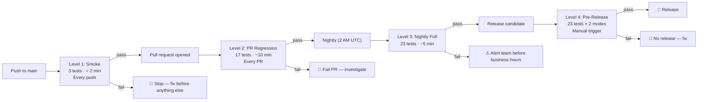

> **File Path:** `docs/testing/REGRESSION_STRATEGY.md`  
> **Related Documents:** [README](../../README.md) | [Index](../reference/INDEX.md) | [Test Plan](TEST_PLAN.md) | [Test Summary Report](TEST_SUMMARY_REPORT.md)

# EMI Calculator - Regression Testing Strategy

**Document Version:** 1.0  
**Date:** December 2024  
**Owner:** QA Automation Team  
**Status:** Active

---

## Executive Summary

This document outlines the regression testing strategy for the EMI Calculator application. It defines how tests are organized, prioritized, and executed to ensure efficient feedback and risk coverage.

**Key Principle:** Risk-based regression testing that balances thoroughness with speed.

---

## 1. Regression Test Classification

### 1.1 Test Maturity Levels

#### Level 1: Smoke Tests (Baseline)

**Purpose:** Quick validation that application is operational  
**Scope:** Absolute minimum viable functionality  
**Execution:** Every push, gates all other testing  
**Duration:** < 2 minutes  
**Failure Action:** STOP - block further testing

**Tests:**

- Page loads successfully
- Default EMI calculates correctly
- Amortization table displays

**Rationale:** If smoke tests fail, no point running deeper tests; immediate alert required

---

#### Level 2: PR Regression Suite (Fast Feedback)

**Purpose:** Validate all features work after code changes  
**Scope:** All critical and high-priority test cases  
**Execution:** Every pull request  
**Duration:** 8-10 minutes  
**Failure Action:** FAIL PR - investigate before merge

**Tests Included:**

- All smoke tests (3 tests)
- All calculation tests (3 tests)
- All consistency tests (4 tests)
- All functional tests (5 tests)
- Basic export tests (2 tests)

**Total:** 17 tests

**Rationale:** Provides comprehensive coverage without boundary cases that take longer

---

#### Level 3: Nightly Full Regression (Comprehensive)

**Purpose:** Thorough validation including edge cases  
**Scope:** All test cases  
**Execution:** Every night at 2 AM UTC  
**Duration:** 18-20 minutes  
**Failure Action:** Alert team for investigation before business hours

**Tests Included:**

- All Level 2 tests (17 tests)
- All boundary tests (6 tests)

**Total:** 23 tests

**Rationale:** Edge cases rarely fail; better to test nightly than slow down every PR

---

#### Level 4: Pre-Release Regression (Validation)

**Purpose:** Final validation before release  
**Scope:** All tests, extended timeout, headless AND headed modes  
**Execution:** Manual trigger before release  
**Duration:** 30-40 minutes  
**Failure Action:** DO NOT RELEASE - investigate and fix

**Tests Included:**

- All Level 3 tests (23 tests)
- Run twice (headless + headed)
- Extended timeouts for stability validation
- Stress test (rapid input changes)

**Rationale:** Release validation requires highest confidence

---

### 1.1.1 Pipeline Overview



**Reading the pipeline:** each level is gated by the one before it; a failure at any level stops or
alerts long before the next tier runs. Feedback latency increases up the tiers (seconds → minutes →
overnight), matching the cost of the edge cases each tier is allowed to carry.

---

### 1.2 Test Categories & Risk Mapping

```
Risk Level          Test Category        Tests    Frequency   When Runs
═══════════════════════════════════════════════════════════════════════
🔴 CRITICAL         Calculation           3        Every PR    L1, L2, L3
                    Consistency           4        Every PR    L1, L2, L3
                    Export Core           2        Every PR    L1, L2, L3
                    ─────────────────────
                    Subtotal              9

🟡 HIGH             Functional            5        Every PR    L2, L3
                    Smoke                 3        Every PR    L1, L2, L3
                    ─────────────────────
                    Subtotal              8

🟢 MEDIUM           Boundary              6        Nightly     L3
                    ─────────────────────
                    Subtotal              6

                    ═════════════════════
                    TOTAL                23        (varies)
```

---

## 2. Test Execution Strategy

### 2.1 Triggers & Automation

#### Push to Main Branch

```yaml
Trigger: Push to main
Tests: Smoke (3)
Time: < 2 min
Action: ✅ Smoke PASS → allow
  ❌ Smoke FAIL → STOP, alert immediately
Report: GitHub Actions log
```

#### Pull Request

```yaml
Trigger: PR opened or updated
Tests: PR Regression (15)
Time: 8-10 min
Action: ✅ ALL PASS → allow merge
  ⚠️  Flaky PASS → investigate after merge
  ❌ ANY FAIL → FAIL PR, must fix before merge
Report: GitHub PR comments + artifacts
```

#### Scheduled (Nightly)

```yaml
Trigger: 2 AM UTC every day
Tests: Full Suite (23)
Time: 18-20 min
Action: ✅ ALL PASS → no action
  ❌ ANY FAIL → create issue, alert team
Report: Email, GitHub issue, dashboard
```

#### Manual (Pre-Release)

```yaml
Trigger: Manual execution before release
Tests: Full Suite × 2 (headless + headed)
Time: 40-60 min
Action: ✅ ALL PASS 2× → safe to release
  ❌ ANY FAIL → DO NOT RELEASE, investigate
Report: Detailed HTML report, sign-off required
```

### 2.2 Parallel Execution Strategy

**Default Workers:** Adaptive (auto — Playwright scales to CPU cores)

**Rationale:**

- Tests are independent (no shared state)
- Each test creates fresh browser context
- Downloads use temporary files (cleaned up)
- Auto-scaled workers balance speed vs. resource usage

**Parallelization by Test:**

```
Worker 1:                     Worker 2:
┌──────────────────────┐     ┌──────────────────────┐
│ Smoke-001            │     │ Smoke-002            │
│ Smoke-003            │     │ Func-001             │
│ Func-002             │     │ Func-003             │
│ Calc-001             │     │ Calc-002             │
│ Cons-001             │     │ Export-001           │
│ Bound-001            │     │ Bound-002            │
│ Bound-003            │     │ Bound-004            │
│ Bound-005            │     │ Bound-006            │
│ (plus others)        │     │ (plus others)        │
└──────────────────────┘     └──────────────────────┘
        ~10 min                    ~10 min
                Total: ~10 min (parallel)
```

---

## 3. Regression Test Composition

### 3.1 Smoke Test Suite (< 2 minutes)

```
3 tests
├── TC-SMOKE-001: Page loads
├── TC-SMOKE-002: Default EMI calculates  [CRITICAL]
└── TC-SMOKE-003: Table displays
```

**When Run:**

- Every push to main (gates PR testing)
- Before regression suite (quick bailout)
- Pre-release validation

**Failure Impact:** Very High - blocks all further testing

---

### 3.2 PR Regression Suite (8-10 minutes)

```
17 tests = Smoke (3) + Calculation (3) + Consistency (4) + Functional (5) + Export (2)

SMOKE (3):
├── TC-SMOKE-001: Page loads
├── TC-SMOKE-002: Default EMI
└── TC-SMOKE-003: Table displays

FUNCTIONAL (5):
├── TC-FUNC-001: Loan amount increase
├── TC-FUNC-002: Loan amount decrease
├── TC-FUNC-003: Interest rate increase
├── TC-FUNC-004: Tenure unit toggle (Yr/Mo)
└── TC-FUNC-005: All three inputs changed together

CALCULATION (3):
├── TC-CALC-001: Standard loan @ 8.5%
├── TC-CALC-002: Large loan precision
└── TC-CALC-003: Small loan rounding

CONSISTENCY (4):
├── TC-CONS-001: EMI ↔ Payment alignment
├── TC-CONS-002: Table ↔ Formula match
├── TC-CONS-003: Table structure (year-wise)
└── TC-CONS-004: Chart slices ↔ table sums

EXPORT (2):
├── TC-EXP-001: Excel download
└── TC-EXP-002: Excel data consistency
```

> **Implementation note:** In the current tag scheme every test is annotated `@regression`,
> so `npm run test:regression` (grep `@regression`) runs the **full 23 tests**, including the
> boundary cases below. The 17-test boundary-free tier above is the design intent; the CI
> gate in `.github/workflows/test.yml` executes smoke → regression (fail-fast, all 23).

**Execution Logic:**

```
IF smoke tests PASS:
  Run PR regression (17 tests)
ELSE:
  STOP and alert

IF PR regression PASS:
  Allow PR merge
ELSE:
  Fail PR and require fix
```

---

### 3.3 Nightly Full Regression (18-20 minutes)

```
23 tests = PR Suite (17) + Boundary (6)

All tests from PR suite PLUS:

BOUNDARY TESTS (6):
├── TC-BOUND-001: Min loan (₹10K)
├── TC-BOUND-002: Max loan (₹2Cr)
├── TC-BOUND-003: Min rate (5%)
├── TC-BOUND-004: Max rate (20%)
├── TC-BOUND-005: Min tenure (1 yr)
└── TC-BOUND-006: Max tenure (30 yrs)
```

**Execution Logic:**

```
Run all 23 tests in parallel (auto-scaled workers)

IF all PASS:
  Success ✅
  Send success notification

IF any FAIL:
  Create GitHub issue with:
    - Failed test name
    - Error details
    - Screenshot/trace
    - Suggest investigation
```

---

### 3.4 Pre-Release Validation (40-60 minutes)

```
Full Suite Executed Twice:

Round 1 (Headless):
  23 tests in headless Chrome
  Standard execution

Round 2 (Headed):
  23 tests with browser visible
  Extended timeouts
  Visual verification

IF both rounds PASS:
  ✅ SAFE TO RELEASE - sign-off authorized
ELSE:
  ❌ DO NOT RELEASE - investigate failures
```

**Extended Configuration:**

```typescript
// Pre-release settings
timeout: 90_000,              // 90 sec per test
navigationTimeout: 45_000,    // 45 sec navigation
retries: 0,                   // No automatic retry
workers: 1,                   // Serial for diagnostics
```

---

## 4. Flakiness Management

### 4.1 Flaky Test Definition

A test is **flaky** if:

- Passes on first run but fails on second run (no code changes)
- Passes sometimes, fails other times randomly
- Inconsistent behavior without environmental change

---

### 4.2 Flakiness Detection

**Automated Detection:**

```bash
# Run same test 5 times - identify flakiness
for i in {1..5}; do
  npx playwright test test/emi.spec.ts -g "test name"
done
```

**Metrics Tracking:**

- Per-test pass rate tracked
- Flakiness % = (failures ÷ runs) × 100
- Target: < 0.5% flakiness
- Threshold for action: > 2% flakiness

---

### 4.3 Root Cause Analysis

| Flakiness Pattern               | Likely Cause      | Fix                                  |
| ------------------------------- | ----------------- | ------------------------------------ |
| Intermittent timeout            | Network latency   | Increase timeout; add wait           |
| Timing-dependent failure        | Async not awaited | Review async/await; add proper waits |
| Download fails randomly         | Timing issue      | Use proper download event handler    |
| Input sometimes doesn't update | DOM not ready     | Wait for element visibility first    |
| Assertion fails occasionally    | Rounding variance | Increase tolerance                   |

---

### 4.4 Flaky Test Handling

**In CI:**

```yaml
If flaky test fails on PR:
  1. Rerun test automatically (Playwright handles)
  2. If passes on retry: continue, but flag
  3. If fails again: fail PR

After merge (if pre-merge retry passed):
  1. Mark as "needs investigation"
  2. Add to backlog for root cause analysis
  3. Consider increasing timeout as stopgap
```

**Investigation Process:**

```
1. Reproduce locally
2. Run with trace file: --trace=on
3. Review trace in Playwright Inspector
4. Identify timing or race condition
5. Apply appropriate fix:
   - Add waitForLoadState()
   - Increase timeout
   - Use explicit waits instead of sleep
   - Improve selector stability
6. Verify fix with multiple runs
7. Update test documentation
```

---

## 5. Test Data Strategy

### 5.1 Data Selection Rationale

**Principle:** Strategic selection rather than exhaustive coverage

| Category    | Scenario                           | Rationale                          | Frequency  |
| ----------- | ---------------------------------- | ---------------------------------- | ---------- |
| Smoke       | Default (₹50L@9%/20y)              | Most common scenario               | Every push |
| Functional  | Typical (₹30L@8.5%/15y)            | Real-world middle market           | Every PR   |
| Functional  | Small (₹1L@12%/3y)                 | Tests rounding in small numbers    | Every PR   |
| Functional  | Large (₹2Cr@7%/25y)                | Tests precision with large amounts | Every PR   |
| Calculation | Formula reference (₹1Cr@10.5%/10y) | Can be manually verified           | Nightly    |
| Boundary    | Min/Max for each parameter         | Tests limits                       | Nightly    |
| Boundary    | Decimal rate (8.75%)               | Tests non-integer inputs           | Nightly    |

**Total Test Scenarios:** 23 (not hundreds of permutations)

**Rationale:** Selected scenarios cover:

- Most common use cases
- Rounding edge cases
- Boundary conditions
- Precision validation
- Real-world scenarios

---

## 6. Regression Report & Metrics

### 6.1 Key Metrics Tracked

```
Per Test Run:
├── Pass Rate (%)
├── Execution Time (seconds)
├── Failure Count
├── Flakiness Incidents
└── Defects Found

Trends (Weekly):
├── Pass Rate Trend
├── Average Execution Time
├── Defect Escape Rate
└── Test Stability
```

### 6.2 Report Format

**GitHub Actions Artifacts:**

```
├── playwright-report/
│   ├── index.html (interactive HTML report)
│   ├── data/
│   │   ├── test-results-*.json
│   │   └── trace-*.zip
│   └── screenshots/
│       └── [failure screenshots]
```

**PR Comment:**

```markdown
## Test Results

✅ **3 / 3** Smoke tests passed (2m 15s)
✅ **15 / 15** Regression tests passed (9m 42s)

**Coverage:**

- Calculation Accuracy: ✅ All critical tests passed
- Data Consistency: ✅ Chart-table alignment verified
- Export: ✅ Excel download validated
- Interaction: ✅ All inputs functioning

[View detailed report →](github.com/...artifacts)
```

**Nightly Report (Email):**

```
EMI Calculator - Nightly Test Run
═════════════════════════════════════
Date: 2026-09-08 02:00 UTC
Suite: Full Regression (23 tests)

Results:
├── ✅ Passed: 23/23 (100%)
├── ❌ Failed: 0
├── ⏱️  Duration: 18m 33s
└── 🔄 Flakiness: 0%

All systems green ✅
```

**Pre-Release Sign-Off:**

```
EMI Calculator - Pre-Release Validation
═════════════════════════════════════════
Release Version: 1.2.0
Validation Date: 2024-12-22

Round 1 (Headless):   23/23 PASS ✅
Round 2 (Headed):     23/23 PASS ✅

Regression Suite:    APPROVED ✅
Excel Export:        APPROVED ✅
Calculation Accuracy: APPROVED ✅

SAFE TO RELEASE: YES ✅

QA Sign-Off: [Signature]
```

---

## 7. Regression Maintenance

### 7.1 Regular Review Schedule

**Weekly:**

- Review flaky test trends
- Check for new timeout patterns
- Monitor test execution time trends

**Monthly:**

- Review test coverage gaps
- Assess redundant tests
- Update test data if needed

**Quarterly:**

- Comprehensive regression analysis
- Update strategy if needed
- Plan enhancements

### 7.2 Test Lifecycle

```
New Feature
    ↓
Write Tests (TC-ID-###)
    ↓
Add to PR Suite? → No → Nightly only
    ↓ Yes
Smoke Tests?  → No → High risk testing
    ↓ Yes
Monitor Flakiness (2 weeks)
    ↓
Stable? → Yes → Production ready ✅
    ↓ No
Investigate & Fix Flakiness
    ↓
Retest (5+ runs)
```

---

## 8. Known Regression Risks

| Risk                   | Category            | Mitigation                 |
| ---------------------- | ------------------- | -------------------------- |
| **DOM changes**        | Locator fragility   | Page Object encapsulation  |
| **Async timing**       | Race conditions     | Proper wait strategies     |
| **Rounding**           | Numerical flakiness | Tolerance-based assertions |
| **Network**            | External dependency | Resilient timeouts         |
| **Download timing**    | File handling       | Proper event-based waiting |
| **Text-input interaction** | Browser-specific    | Direct value setting       |

---

## 9. Escalation & Issue Handling

### 9.1 Test Failure Escalation

```
Test Fails on PR:
  ├─ Immediate: Fail PR
  ├─ Action: Developer investigates
  ├─ Decision: Fix or revert changes
  └─ Resolution: Retest or merge after fix

Test Fails in Nightly:
  ├─ Morning: Alert QA team
  ├─ Action: Investigate root cause
  ├─ Decision: Hotfix or schedule for sprint
  └─ Resolution: Track in issue backlog

Test Fails Pre-Release:
  ├─ Immediate: Block release
  ├─ Action: Emergency investigation
  ├─ Decision: Fix before release
  └─ Resolution: Retest before release deployment
```

### 9.2 Defect Classification

If regression test finds defect:

```
Severity Assessment:
├─ P0 (Critical): Calculation wrong → HOTFIX
├─ P1 (High): Feature broken → Must fix before release
├─ P2 (Medium): Edge case failure → Schedule for next sprint
└─ P3 (Low): Cosmetic issue → Backlog

Test Coverage:
├─ If test is high-value: Add to PR suite
├─ If test is niche: Keep in nightly
└─ If test is boundary: Add to quarterly validation
```

---

## 10. Regression Test Success Criteria

### Release Readiness Checklist

```
✅ All smoke tests pass (3/3)
✅ All PR regression tests pass (17/17)
✅ No new test failures introduced
✅ Flakiness < 0.5% across suite
✅ No high-priority defects open
✅ Test execution time < 20 min
✅ Pre-release validation: 23/23 PASS (both rounds)
✅ No unresolved test issues in backlog
✅ Test coverage adequate for risk level
✅ Traceability from requirements → test cases verified
```

**If all checkboxes ✅:** Application is regression-safe and ready for release

---

## Appendix A: Regression Test Mapping to Requirements

| Requirement                      | Test Case                             | Priority |
| -------------------------------- | ------------------------------------- | -------- |
| REQ-001: Loan amount input       | TC-FUNC-001, TC-FUNC-002              | P1       |
| REQ-002: Interest rate input     | TC-FUNC-003                           | P1       |
| REQ-003: Tenure input            | TC-FUNC-004, TC-FUNC-005              | P1       |
| REQ-004: Combined input change   | TC-FUNC-005                           | P1       |
| REQ-005: EMI formula correctness | TC-CALC-001, TC-CALC-002, TC-CALC-003 | P0       |
| REQ-006: Payment relationship    | TC-CONS-001                           | P0       |
| REQ-007: Amortization schedule   | TC-CONS-002                           | P0       |
| REQ-008: Boundary handling       | TC-BOUND-001-007                      | P2       |
| REQ-009: Excel download          | TC-EXP-001                            | P1       |
| REQ-010: Data export integrity   | TC-EXP-002                            | P1       |

---

**Document Status:** Active  
**Last Review:** December 2024  
**Next Review:** March 2025  
**Approval:** QA Automation Architect
