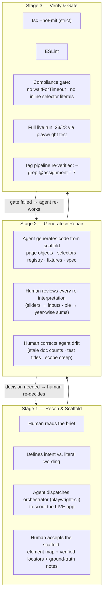
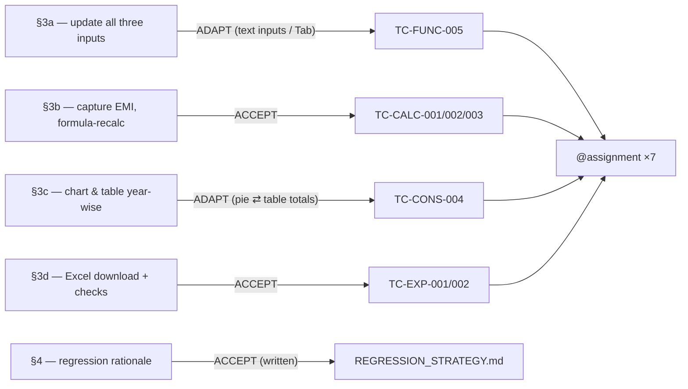

> **File Path:** `docs/testing/REQUIREMENT_MAPPER.md`
> **Related Documents:** [README](../../README.md) | [Index](../reference/INDEX.md) | [Test Plan](TEST_PLAN.md) | [Test Case Matrix](TEST_CASE_MATRIX.md) | [Regression Strategy](REGRESSION_STRATEGY.md)

# Requirement Mapper — How the Assignment Was Conceptualized, Decided, and Delivered

## 1. Purpose

This document is the **single source of truth for the trace** between the original
assignment brief, the *human* decisions made about it, and the automated artefacts that
result. It is deliberately written from the perspective of **the engineer at the helm**:

> The assignment was **given to a person**. The person **conceptualized** the automation,
> **negotiated** with the evidence on screen, decided **what to accept, what to adapt, what
> to defer**, and then **harnessed a coding agent** to execute. This document records that
> chain of reasoning so anyone reading the deliverables can reconstruct *why* every test
> exists, and *why* it asserts what it asserts.

Tags referred to here are real, executable metadata: `npx playwright test --grep "@assignment"`.

---

## 2. The Origin — The Requirements As Given

The target is the live Home Loan EMI calculator at **`https://emicalculator.net/`**.

The assignment placed four automation demands and one written-deliverable demand:

| ID | Requirement (verbatim intent) |
|----|-------------------------------|
| **§3a** | Update **Home Loan Amount, Interest Rate and Loan Tenure** and verify recalculation. |
| **§3b** | **Capture EMI** and validate it using **formula-based recalculation in test code**. |
| **§3c** | Validate **Chart and Table values match year-wise**. |
| **§3d** | **Download the Excel file** and add checks on it. |
| **§4**  | Regression suite: **design rationale** (written, not code). |

The assignment's wording carried three **unstated assumptions** the engineer had to test
against reality before writing a single locator.

---

## 3. Ground Truth — What the Assignment Assumed vs. What the App Actually Is

Before any requirement could be "accepted for automation", the live application was
inspected (browser-driven recon) to separate **stated intent** from **implementation reality**.

| # | Assignment implied | App reality (verified on the live site) | Consequence |
|---|--------------------|-----------------------------------------|-------------|
| 1 | Amount / rate / tenure are edited **"using a slider"** | The widgets are **live text inputs** (`#loanamount`, `#loaninterest`, `#loanterm`). They recalculate **on Tab commit**, not on a slider drag. There is no slider. | Treat the demand as intent: *"let the user change all three inputs and see EMI update"*. Adapt the mechanism to the shipped widget. |
| 2 | Chart and table "match **year-wise**" implies a per-year chart series | The chart is a **Highcharts aggregate pie** (Principal % / Interest %). The **year-wise data lives only in the amortization table** (grouped by calendar year via the starting month). | Cannot compare a per-year series that does not exist. Re-frame as: **the pie percentages must equal the year-wise table totals expressed as percentages**. |
| 3 | A slide/export is a black box | The Excel export is **monthly rows**; the UI table is **calendar-year groups**. The first year can be partial. | Any Excel check must **aggregate monthly → calendar years** before comparing to the UI table. |
| 4 | The regression item (Q4a) is a code deliverable | It is a **written, design-oriented answer**. | Delivered as a strategy document (`REGRESSION_STRATEGY.md`), not code. |

> **Decision rule applied throughout:** a requirement is satisfied by the **intent** it
> expresses, validated against observed behaviour — never by a literal reading that the app
> cannot honour.

---

## 4. The Decision Log — Accept / Adapt / Defer per Demand

The engineer's judgement at the top of each demand is recorded here. Every "ADAPT" is
justified by a ground-truth finding from §3, so a reviewer can audit the re-interpretation.

### §3a — Update Home Loan Amount, Interest Rate and Loan Tenure

- **Decision: ADAPT (mechanism) + ACCEPT (intent).**
- The app ships **text inputs** recalculating on **Tab**; the assignment presumed sliders.
  The senior judgement: the *testable outcome* is "changing all three values recalculates a
  correct EMI" — that outcome is identical regardless of widget. Automating a ghost slider
  would be theatre.
- Implemented to also cover **individual** changes (amount up, rate up, tenure down) so the
  combined test has a baseline, plus the **unit toggle** (years ⇄ months) because it changes
  how tenure is interpreted.
- **Core test:** TC-FUNC-005 — *"should update EMI when all three inputs change
  together"* — sets ₹35,00,000 @ 8.25% / 12y, asserts the recalculated EMI matches an
  independent formula to within a tolerance, and asserts the inputs retain the entered
  values.

### §3b — Capture EMI and validate via formula-based recalculation in test code

- **Decision: ACCEPT (fully).**
- This is the heart of the assignment. The suite carries an **independent EMI oracle**
  (`src/domain/emiCalculator.ts`) — standard monthly-compounding amortization math — so the
  app is never trusted self-referentially.
- The displayed EMI is **captured from the UI**, then validated against the oracle.
  Tolerance is **±₹2** (the app rounds EMI to whole rupees; the oracle computes exact math).
- **Core tests:** TC-CALC-001/002/003 — *"should calculate correct EMI: Typical / Low /
  High Loan Amount"* — each also asserts Total Interest and Total Payment against the
  oracle, and the year-wise amortization rows against an independently re-derived schedule.

### §3c — Validate Chart and Table values match year-wise

- **Decision: ADAPT (representation).**
- Ground truth (§3 #2): the chart is an aggregate **pie**, the year-wise data exists in the
  **table**. The only faithful "match" is **pie-slice percentage ⇄ table-total percentage**.
- Implementation: sum the table's Principal and Interest columns across all calendar years,
  derive expected percentages, parse the pie's `%` labels (which sit in `<tspan>` children —
  a discovery that changed the selector), and compare with a **±0.3 pt** tolerance; the two
  slices must also sum ≈ 100%.
- **Core test:** TC-CONS-004 — *"should validate chart slices match year-wise table sums."*

### §3d — Download Excel file and add checks

- **Decision: ACCEPT (fully).**
- The Excel export is captured via Playwright's file download, parsed with an xlsx reader,
  and checked at two levels:
  - **Structure** (TC-EXP-001): valid file, expected headers, 12 monthly columns per
    calendar year, correct row count for the tenure, numeric cells.
  - **Content** (TC-EXP-002): **monthly rows are aggregated to calendar years** (partial
    first year handled) and compared to the **UI table** within a tolerance.
- **Core tests:** TC-EXP-001, TC-EXP-002.

### §4 — Regression suite design (written)

- **Decision: ACCEPT; but classified as ornamental/written**, not code.
- Delivered as `docs/testing/REGRESSION_STRATEGY.md`: a risk-tiered model
  (Smoke 3 → PR 17 → Nightly 23 → Pre-release 23×2), an oracle-based EMI validation
  approach, tolerance-based assertions, no fixed waits, and a centralized selector registry.
  The written answer is the deliverable; the tag pipeline merely mirrors the tiers it names.

### Explicitly deferred / rejected

| Item | Rationale |
|------|-----------|
| PDF export checks | Not requested; the Excel demand is the download scope. |
| Multi-browser matrix | Chromium-only per scope; strategy doc notes expansion path. |
| Visual regression of the pie | Percentages are assertion-grade; pixel-checks add noise, not signal. |
| A hybrid jewellery chart by year | Not an existing widget; no faithful assertion possible. |
| Fixed `waitForTimeout` polls | Rejected as an anti-pattern by the compliance gate. |

---

## 5. What Was Automated — Scope of the Suite

**23 tests** in `tests/emi.spec.ts`, organised as six describe blocks. Of these, **7 are
tagged `@assignment`** — they are the tests that carry the four demands directly:

```
npx playwright test --grep "@assignment"
```

| Assignment test | Line | Covers |
|-----------------|------|--------|
| should update EMI when all three inputs change together (TC-FUNC-005) | `emi.spec.ts:237` | §3a |
| should calculate correct EMI: Typical Home Loan (TC-CALC-001) | `emi.spec.ts:304` | §3b |
| should calculate correct EMI: Low Loan Amount (TC-CALC-002) | `emi.spec.ts:304` | §3b |
| should calculate correct EMI: High Loan Amount (TC-CALC-003) | `emi.spec.ts:304` | §3b |
| should validate chart slices match year-wise table sums (TC-CONS-004) | `emi.spec.ts:531` | §3c |
| should download Excel file with valid structure (TC-EXP-001) | `emi.spec.ts:582` | §3d |
| should match Excel data with UI table (TC-EXP-002) | `emi.spec.ts:616` | §3d |

The remaining 16 tests are **supporting coverage** the engineer commissioned to make the
core claims non-vacuous: smoke, individual input changes, boundary limits, unit toggle,
and cross-value consistency. They carry the `@smoke` / `@functional` / `@boundary` /
`@consistency` / `@export` / `@regression` / `@critical` tags and filter independently.

---

## 6. What Was Asserted — The Assertion Contracts

Every assertion is an *independent* check, not a re-read of the same value:

| Layer | Asserted invariant | Tolerance | How it's asserted |
|-------|--------------------|-----------|-------------------|
| EMI | Captured EMI == formula EMI | ±₹2 (whole-rupee rounding) | UI text vs `calculateEMI()` oracle |
| Totals | Total Interest + Total Payment == formula | ±₹10 | UI text vs oracle totals |
| Table | Each calendar-year row == oracle schedule row | ±₹10 | `aggregateToCalendarSchedule()` vs UI rows |
| Chart | Pie Principal % / Interest % == table-derived % | ±0.3 pt | Highcharts `%` labels vs summed table columns; slices ≈ 100% |
| Excel structure | Headers, monthly columns, row count, numeric cells | exact | xlsx parser |
| Excel content | Aggregate(monthly excel) == UI calendar-year table | ±₹10 | calendar-year aggregation util |
| Inputs | Entered values persist after recalc | exact | field values re-checked |

Orchestration rules the engineer enforced on the agent, which *shape* what can be asserted:

- **No fixed sleeps.** Recalculation readiness is detected by observable signal (result text
  changes) — so assertions always race against reality, never a timer.
- **No inline selector literals.** All locators live in the `SELECTORS` registry; the page
  object drives them. The selector registry is where chart-discovery findings
  (`pieChartPercentages: "svg text"`, `<tspan>` handling) are captured.
- **Oracle in domain layer.** `src/domain/emiCalculator.ts` is pure logic, unit-testable
  without a browser, reused by every layer of assertion.

---

## 7. The Harness — How the Human Drove the Machine

The engineering work was **conceived and steered by the person**; the agent executed under
enforced contracts. The loop ran in three stages:



Responsibilities were deliberately split:

| The human decided | The agent executed |
|-------------------|--------------------|
| Which requirements to accept / adapt / defer | Turning accepted decisions into TypeScript |
| The assertion contracts and tolerances | Writing locators against the verified registry |
| The test taxonomy and tag scheme (`@assignment`, `@critical`, tiers) | Running and repairing the suite to green |
| Which discoveries were bugs vs. intended behaviour | Reporting failures and evidence |
| The written regression strategy | Never writing speculative UI code (explore → automate chain) |

The human also set **acceptance criteria for the agent's own output**: code that
type-checks, lints clean, contains zero fixed waits, zero inline selectors, and passes
against the **live** site — not mocked fixtures. Every gate failed means *the agent*
re-worked; every judgement call means *the human* re-decided.

---

## 8. Traceability Matrix (Final)



| Demand | Decision | Test ID(s) | Spec ref | Status |
|--------|----------|-----------|----------|--------|
| §3a — update all three inputs | ADAPT (text inputs / Tab) | TC-FUNC-005 | `emi.spec.ts:237` | ✅ 23/23 passing |
| §3b — capture EMI, formula-recalc | ACCEPT | TC-CALC-001/002/003 | `emi.spec.ts:304` | ✅ |
| §3c — chart & table year-wise | ADAPT (pie ⇄ year totals) | TC-CONS-004 | `emi.spec.ts:531` | ✅ |
| §3d — Excel download + checks | ACCEPT | TC-EXP-001/002 | `emi.spec.ts:582`, `:616` | ✅ |
| §4 — regression rationale (written) | ACCEPT as document | — | `docs/testing/REGRESSION_STRATEGY.md` | ✅ delivered |
| (supporting coverage) | human-commissioned | 16 more tests | `tests/emi.spec.ts` | ✅ |

---

## 9. The Takeaway

The automation was not *generated* — it was **engineered**. The human:

1. **Read the intent**, not the letter (sliders → inputs; per-year chart → pie-versus-table).
2. **Proved assumptions on the live site** before accepting anything (the §3 ground truth).
3. **Chose what to accept, adapt, and defer**, with every re-interpretation justified in this log.
4. **Set the assertion contracts** — every check is independent and tolerance-bound.
5. **Harnessed the agent under contracts** — staged pipeline, compliance gates,
   type/lint/live-run verification — and personally re-decided whenever the machine drifted.

The seven `@assignment` tests are the contract, and they pass against production.
Everything else is deliberate scaffolding a senior engineer commissioned to make those
seven claims trustworthy.