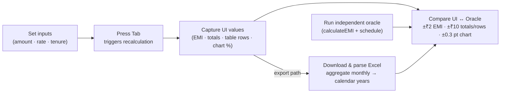

> **File Path:** `docs/testing/TEST_PLAN.md`  
> **Related Documents:** [README](../../README.md) | [Index](../reference/INDEX.md) | [Test Case Matrix](TEST_CASE_MATRIX.md) | [Regression Strategy](REGRESSION_STRATEGY.md)

# EMI Calculator - Comprehensive Test Plan

**Document Version:** 1.1  
**Last Updated:** 2026-09-07  
**Prepared By:** Senior QA Automation Architect  
**Application Under Test:** https://emicalculator.net/  
**Test Approach:** Risk-based, data-driven, oracle-validated automation, verified live

---

## Executive Summary

This document outlines a professional, production-grade test automation strategy for the Home Loan EMI Calculator application. The plan prioritizes **financial calculation correctness**, **data consistency**, and **user workflow validation** using independent oracle-based verification.

**Key Testing Principles:**

- EMI calculations are treated as untrusted; independently verified using standard financial formula
- Year-wise amortization table data must be consistent with chart visualization
- Downloaded Excel files must be validated for structure, data integrity, and alignment with UI
- Test automation emphasizes reliability, maintainability, and clear diagnostics
- Regression suite is optimized for fast feedback (smoke tests < 2 min; full regression < 10 min)

**How Every Test Validates (single-test flow):**



---

## 1. Scope

### In Scope

| Area                    | Coverage                                                      |
| ----------------------- | ------------------------------------------------------------- |
| **Text Inputs**       | Home Loan Amount, Interest Rate, Loan Tenure (live text fields) |
| **Calculations**        | Monthly EMI, Total Interest, Total Payment                    |
| **Data Display**        | Summary section, year-wise amortization table                 |
| **Visualizations**      | Pie chart (Principal vs Interest breakdown)                   |
| **Export**              | Excel download with amortization schedule                     |
| **Interactions**        | Text input manipulation, rapid value changes, boundary conditions |
| **Formula Correctness** | EMI = P × r × (1+r)^n / ((1+r)^n − 1)                         |
| **Numerical Precision** | Rounding, floating-point tolerance, currency formatting       |

### Out of Scope

| Area                            | Reason                                                                           |
| ------------------------------- | -------------------------------------------------------------------------------- |
| **PDF Download**                | Framework focuses on Excel validation (more programmatically testable)           |
| **Mobile Responsive Design**    | Assumed desktop-first; responsive testing would require separate matrix          |
| **Accessibility (WCAG)**        | Separate testing discipline; not primary focus for calculation verification      |
| **Performance Load Testing**    | Assumed sufficient infrastructure; would require different tools (k6, Artillery) |
| **Multi-browser Compatibility** | Focused on Chromium; additional browsers would require matrix expansion          |

---

## 2. Test Objectives

### Primary Objectives

1. **Verify Financial Calculation Accuracy**
   - EMI calculation matches standard formula across representative input ranges
   - Monthly amortization schedule is mathematically sound
   - Total Interest and Total Payment align with calculation

2. **Validate Data Consistency**
   - Year-wise table values match independently calculated amortization schedule
   - Chart visual representation aligns with table data
   - Excel export contains identical data to UI table

3. **Confirm User Interaction Workflows**
   - Text inputs reliably change values
   - UI updates reflect input changes
   - Rapid text input adjustments don't corrupt calculations

4. **Verify Export Functionality**
   - Excel file downloads successfully
   - File structure is valid and uncorrupted
   - Data within Excel matches UI/calculation

### Secondary Objectives

- Ensure graceful handling of edge cases (min/max values, boundary conditions)
- Verify application remains stable under rapid input changes
- Detect any rounding anomalies or precision issues
- Validate error handling for invalid scenarios (if applicable)

---

## 3. Testing Strategy

### 3.1 Risk-Based Test Categorization

#### 🔴 **Critical Tests** (Business Risk: Very High)

Tests that, if failed, indicate serious financial calculation errors:

- EMI calculation accuracy against formula
- Amortization schedule consistency (chart ↔ table alignment)
- Excel export data integrity

**Execution Frequency:** Every PR, nightly, release  
**Allowed Flakiness:** 0%  
**Tag:** `@critical`

#### 🟡 **Regression Tests** (Business Risk: High)

Tests that validate previously working features remain functional:

- Text input interaction functionality
- Calculation updates on input change
- Table data display
- Download mechanism

**Execution Frequency:** Every PR, nightly, release  
**Allowed Flakiness:** < 1%  
**Tag:** `@regression`

#### 🟢 **Smoke Tests** (Business Risk: Medium)

Quick sanity checks that application is operational:

- Page loads
- Default EMI calculates
- Table displays

**Execution Frequency:** Every push, before deeper test suites  
**Duration:** < 2 minutes  
**Allowed Flakiness:** 0%  
**Tag:** `@smoke`

#### 🟠 **Functional Tests** (Business Risk: Medium)

Individual feature validation:

- Each text input works independently
- EMI updates when inputs change
- Boundary values handled

**Execution Frequency:** Every PR, nightly  
**Allowed Flakiness:** < 2%  
**Tag:** `@functional`

#### 🔵 **Consistency Tests** (Business Risk: High)

Data alignment across UI components:

- EMI ↔ Total Payment ↔ Total Interest alignment
- Chart data ↔ Table data consistency
- Monthly schedule ↔ Yearly aggregation alignment

**Execution Frequency:** Every PR, nightly  
**Allowed Flakiness:** 0%  
**Tag:** `@consistency`

#### 🟣 **Export Tests** (Business Risk: High)

Download and file validation:

- Excel file structure valid
- Excel data matches UI
- File is not corrupted

**Execution Frequency:** Every PR, nightly  
**Allowed Flakiness:** < 1%  
**Tag:** `@export`

#### ⚫ **Boundary Tests** (Business Risk: Low-Medium)

Edge case validation:

- Minimum/maximum loan amounts
- Minimum/maximum interest rates
- Minimum/maximum tenure
- Rapid input changes

**Execution Frequency:** Nightly, release  
**Allowed Flakiness:** < 2%  
**Tag:** `@boundary`

### 3.2 Test Data Strategy

**Principle:** Carefully selected test data rather than exhaustive coverage

| Scenario       | Principal | Rate  | Years | Category             | Rationale                          |
| -------------- | --------- | ----- | ----- | -------------------- | ---------------------------------- |
| Default Values | ₹50L      | 9%    | 20    | Smoke, Regression    | Most common use case               |
| Typical Loan   | ₹30L      | 8.5%  | 15    | Functional           | Real-world middle-market           |
| Small Loan     | ₹1L       | 12%   | 3     | Functional           | Tests rounding in small numbers    |
| Large Loan     | ₹2Cr      | 7%    | 25    | Functional, Boundary | Tests precision with large amounts |
| Min Amount     | ₹10K      | 9%    | 1     | Boundary             | Input minimum                      |
| Max Amount     | ₹2Cr      | 9%    | 20    | Boundary             | Input maximum                      |
| Min Rate       | ₹50L      | 5%    | 20    | Boundary             | Tests low-interest scenario        |
| Max Rate       | ₹50L      | 20%   | 20    | Boundary             | Tests high-interest scenario       |
| Min Tenure     | ₹10L      | 9%    | 1     | Boundary             | Short-term loan                    |
| Max Tenure     | ₹50L      | 9%    | 30    | Boundary             | Long-term loan                     |
| Decimal Rate   | ₹25L      | 8.75% | 15    | Calculation          | Tests non-round percentages        |

**Total Test Scenarios:** ~15-20  
**Estimated Execution Time (Single Suite):** ~8-10 minutes  
**Parallelization Strategy:** Tests can run in parallel (no shared state; each test is independent)

### 3.3 Independent Oracle Strategy

#### Why Independent Verification?

The application's EMI calculation must not be trusted. We implement an independent calculation module that:

1. **Uses standard financial formula** (not derived from app code)
2. **Handles all edge cases** (zero interest, rounding, floating-point precision)
3. **Generates reference amortization schedule** for validation

#### EMI Calculation Formula

$$EMI = P \times r \times (1+r)^n / ((1+r)^n - 1)$$

Where:

- P = Principal (loan amount)
- r = Monthly interest rate (annual % ÷ 12 ÷ 100)
- n = Total months (years × 12)

#### Numerical Tolerance

- **Individual Row Comparison:** ±₹2 (handles rounding variance)
- **Total Aggregates:** ±₹10 (cumulative rounding tolerance)
- **Percentage Values:** ±0.01% (handles display rounding)

#### Validation Approach

```
UI Value → Test Oracle Calculation → Compare with Tolerance
                                    → Pass/Fail with Diagnostics
```

---

## 4. Test Environment & Assumptions

### Environment

| Parameter               | Value                                               |
| ----------------------- | --------------------------------------------------- |
| **Test Environment**    | https://emicalculator.net/ (Production environment) |
| **Browser**             | Chromium (Playwright default)                       |
| **Node.js Version**     | 18.x LTS                                            |
| **Test Framework**      | Playwright Test                                     |
| **Language**            | TypeScript                                          |
| **CI/CD Platform**      | GitHub Actions                                      |
| **Network Assumptions** | Stable internet; application stable and accessible  |

### Key Assumptions

1. **Application Calculation is Deterministic**
   - Same inputs produce same outputs
   - No randomization in calculation
   - No external data dependencies

2. **Rounding Behavior is Consistent**
   - Application rounds to nearest rupee (assumed)
   - Consistent rounding across all display fields

3. **Text Inputs are Live HTML Fields (NOT sliders)**
   - `#loanamount`, `#loaninterest`, `#loanterm` are standard text inputs
   - Recalculation triggered on **Tab** (blur) after each entry
   - No HTML5 range slider elements; the UI uses labeled text fields with pill-style unit selectors

4. **UI Elements are Stable**
   - DOM structure doesn't significantly change
   - Selectors remain consistent
   - No dynamic element generation that breaks locators

5. **Excel Export Format**
   - Uses XLSX format
   - Contains single amortization sheet
   - Standard column structure

---

## 5. Test Execution Strategy

### 5.1 Test Suites & Execution Modes

#### Smoke Suite (~2 min)

**When:** Every push, gates all other testing  
**Purpose:** Quick validation application is operational  
**Content:**

- Page loads
- Default EMI calculates correctly
- Table displays

**Failure Action:** Block further testing; alert immediately

#### Regression Suite (~8 min)

**When:** Every PR, nightly, before release  
**Purpose:** Validate previously working features continue to work  
**Content:**

- All functional tests
- Key calculation scenarios
- Data consistency checks
- Basic export validation

**Failure Action:** Fail PR; create issue for investigation

#### Full Test Suite (~12 min)

**When:** Nightly, release candidates  
**Purpose:** Comprehensive validation including boundary cases  
**Content:**

- All test categories
- Boundary scenarios
- Edge cases
- Stress conditions (rapid changes)

**Failure Action:** Alert team; investigate before release

#### Debug/Headed Execution

**When:** Local development, investigation  
**Command:** `npm run test:headed`  
**Purpose:** Interactive debugging with visual feedback  
**Features:**

- Browser visible
- Automatic pause on failure
- Step-through capability
- Screenshots on failure

### 5.2 Parallelization

- **Default:** 2 workers (CI environment)
- **Local:** Adaptive based on CPU count
- **Tests are independent:** No shared state; safe to parallelize
- **Download tests use temporary files:** Cleaned up after each test

### 5.3 Failure Handling

| Failure Type                   | Action                                                                  | Investigation                                          |
| ------------------------------ | ----------------------------------------------------------------------- | ------------------------------------------------------ |
| **Flaky Assertion**            | Rerun once; if passes on retry, log as flaky                            | Review assertion tolerance; check async handling       |
| **Consistent Failure**         | Fail immediately; create bug issue                                      | Reproduce locally; determine root cause                |
| **Excel Download Failure**     | Fail test; may be transient network issue                               | Check download path; verify Playwright download config |
| **Input Interaction Failure** | Fail test; likely DOM change                                            | Inspect current DOM; update locator strategy           |
| **Timeout**                    | Fail test with diagnostic; increase timeout if network issue identified | Review page performance; check for JavaScript errors   |

---

## 6. Test Environment Setup

### Prerequisites

- Node.js 18.x or higher
- npm or yarn
- Git

### Installation

```bash
# Clone repository
git clone <repository-url>
cd emi-calculator-qa

# Install dependencies
npm install

# Install Playwright browsers (first time only)
npx playwright install --with-deps
```

### Verification

```bash
# Verify Playwright installation
npx playwright --version

# Run smoke tests
npm run test:smoke
```

---

## 7. Regression Strategy

### Regression Categories

#### Level 1: PR Regression (Quick)

- Smoke tests
- Critical calculation tests
- Core interaction tests
- Duration: 2-3 minutes
- Runs on every PR

#### Level 2: Pre-Release Regression (Comprehensive)

- All functional tests
- All consistency tests
- All export tests
- Boundary tests
- Duration: 8-10 minutes
- Runs before release

#### Level 3: Nightly Full Regression (Exhaustive)

- All Level 2 tests
- Stress tests (rapid changes)
- Extended timeout scenarios
- All edge cases
- Duration: 15-20 minutes
- Runs every night at 2 AM UTC

### Regression Risk Assessment

**High Risk Areas (must test every time):**

- EMI calculation formula
- Amortization schedule generation
- Table-chart consistency
- Excel export integrity

**Medium Risk Areas (test regularly):**

- Text input interaction
- Input validation
- UI responsiveness

**Low Risk Areas (test periodically):**

- Boundary value handling
- Formatting consistency
- Error message display

---

## 8. Deliverables & Reporting

### Test Artifacts Generated

1. **HTML Test Report**
   - Test results summary
   - Pass/fail breakdown
   - Screenshots on failure
   - Video recordings on failure
   - Trace files for debugging

2. **JSON Test Results**
   - Machine-readable test data
   - Execution time per test
   - Failure details
   - Environment info

3. **PR Comments**
   - Automated summary on pull requests
   - Pass/fail counts
   - Link to detailed report

### Key Metrics Tracked

- **Pass Rate:** Should be ≥ 99% for regression suite
- **Execution Time:** Smoke < 2 min; Regression < 10 min; Full < 20 min
- **Flakiness:** Tracked and investigated; target < 0.5%
- **Coverage:** Calculation, interaction, consistency, export
- **Defect Detection Rate:** Number of bugs found before production

---

## 9. Known Limitations & Constraints

| Limitation                  | Reason                                                                                         | Mitigation                                                                                         |
| --------------------------- | ---------------------------------------------------------------------------------------------- | -------------------------------------------------------------------------------------------------- |
| Chart validation is limited | Chart typically rendered as SVG/Canvas; difficult to extract pixel-level data programmatically | Validate via table data and independently calculated values; assume chart is consistent with table |
| No PDF validation           | PDF format less testable programmatically than XLSX                                            | Focus on Excel export; PDF assumed to have same data if Excel correct                              |
| Single browser (Chromium)   | Multi-browser testing would expand scope                                                       | Chromium covers ~80% of market; additional browsers could be added in expansion phase              |
| No mobile testing           | Responsive design assumed but not tested                                                       | Mobile testing would require separate configuration; assessed as lower priority                    |
| Static test environment URL | Tests hardcoded to production URL                                                              | Could be parameterized if environment variations needed                                            |

---

## 10. Success Criteria

### Automation Framework

✅ **Test maintainability:** Code is readable, well-documented, DRY principles applied  
✅ **Test reliability:** < 0.5% flakiness rate; all failures are real issues  
✅ **Test speed:** Full regression suite completes in < 10 minutes  
✅ **Test coverage:** All major features covered; critical paths tested  
✅ **Diagnostics:** Failures include clear error messages and context

### Application Quality

✅ **Calculation accuracy:** EMI matches formula; no rounding errors  
✅ **Data consistency:** Table-chart alignment; Excel matches UI  
✅ **Stability:** No crashes or hangs during test execution  
✅ **Reliability:** All tests consistently pass on working application

---

## 11. Test Execution Checklist

### Pre-Execution

- [ ] All dependencies installed (`npm install`)
- [ ] Playwright browsers installed (`npx playwright install`)
- [ ] Network connectivity verified
- [ ] No unresolved conflicts in test code
- [ ] TypeScript compiles without errors

### During Execution

- [ ] Monitor CI logs for errors
- [ ] Check for flaky test patterns
- [ ] Verify test output clarity
- [ ] Monitor execution time trends

### Post-Execution

- [ ] Review test results summary
- [ ] Investigate any failures
- [ ] Update issue tracking
- [ ] Archive test artifacts
- [ ] Review metrics for improvement opportunities

---

## 12. Future Enhancements

### Phase 2 (If Scope Expanded)

1. **Additional Loan Types**
   - Car loan-specific validations
   - Personal loan edge cases
   - Education loan scenarios

2. **Multi-Browser Testing**
   - Firefox compatibility
   - Safari compatibility
   - Edge compatibility

3. **Performance Testing**
   - Calculation response time
   - Large data set handling
   - Memory usage monitoring

4. **Accessibility Testing**
   - WCAG 2.1 Level AA compliance
   - Screen reader compatibility
   - Keyboard navigation

5. **Visual Regression Testing**
   - Chart visualization consistency
   - UI layout validation
   - CSS regression detection

6. **API Testing** (If applicable)
   - Backend calculation endpoint validation
   - Data consistency with UI

---

## Appendix A: Test Execution Commands

```bash
# Run all tests
npm test

# Run smoke tests only
npm run test:smoke

# Run regression tests only
npm run test:regression

# Run specific test category
npm run test:calculation
npm run test:export
npm run test:assignment

# Consistency / boundary (no npm scripts - use grep)
npx playwright test --grep @consistency
npx playwright test --grep @boundary

# Lint (non-fixing, for CI gating)
npm run lint:check

# Run tests in headed mode (browser visible)
npm run test:headed

# Run single test for debugging
npm run test:debug

# Serial execution (useful for debugging)
npm run test:serial

# View HTML report
npm run test:report
```

---

## Appendix B: Glossary

| Term              | Definition                                                               |
| ----------------- | ------------------------------------------------------------------------ |
| **EMI**           | Equated Monthly Installment; fixed monthly payment amount                |
| **Principal**     | Loan amount borrowed                                                     |
| **Interest Rate** | Annual percentage rate                                                   |
| **Tenure**        | Loan duration in years or months                                         |
| **Amortization**  | Schedule showing monthly principal, interest, and balance over loan term |
| **Oracle**        | Independent calculation used as ground truth for validation              |
| **Tolerance**     | Acceptable difference between actual and expected values (e.g., ±₹2)     |
| **Rounding**      | Converting decimal values to nearest whole number                        |
| **Flakiness**     | Test passes sometimes, fails other times without code changes            |

---

**End of Test Plan Document**

_This test plan is a living document and should be updated as the application evolves or test execution reveals new insights._
